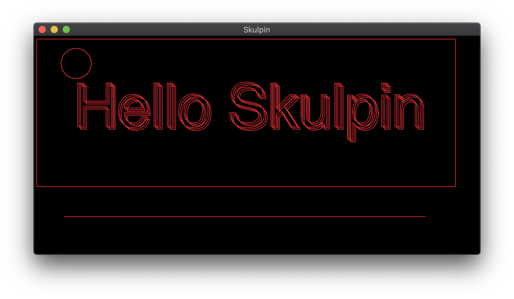

# skulpin

Skia + Vulkan = Skulpin

This crate provides an easy option for drawing hardware-accelerated 2D by combining vulkan and skia.

[](https://travis-ci.org/aclysma/skulpin)




This crate mainly depends on:
 * [rafx](https://github.com/aclysma/rafx) - A rendering framework with easy access to the vulkan backend
 * [skia-safe](https://github.com/rust-skia/rust-skia) - [Skia](https://skia.org) bindings for Rust

NOTE: See [skia-bindings](https://crates.io/crates/skia-bindings) for more info on how a skia binary acquired. In many
cases, this crate will download a binary created by their project's CI.

This crate integrates with [raw-window-handle](https://crates.io/crates/raw-window-handle), which allows it to be used
with sdl2, winit, and any other windowing framework that supports raw-window-handle.

## Running the Examples

First, ensure that the below requirements are met depending on OS. Afterwards, the examples can be run normally.

The [interactive](examples/interactive_winit_app.rs) example is good to look at for an easy way to get keyboard/mouse input.

```
# winit 0.24
cargo run --example interactive_winit_app --features winit-app,winit-25

# sdl2
cargo run --example interactive_sdl2
```

The [physics](examples/physics.rs) demo is fun too.

```
cargo run --example physics --features winit-app,winit-25
```

Here's a video of the physics and interactive examples.

[](https://www.youtube.com/watch?v=El99FgGSzfg "Video of Skulpin")

## Status

This crate is in "maintenance" mode - I'm not adding features or planning any API reworks, but I do plan to make fixes
as necessary to address issues that might come up and maintain compatibility with the broader rust ecosystem.

Originally this was just a proof-of-concept, but it is now being used by [neovide](https://github.com/Kethku/neovide).

Flutter, Google's new UI framework, uses a Skia + Vulkan stack to achieve 60+ FPS on mobile devices. Because Google is
deeply invested in this stack, I anticipate relatively long term support of this type of usage in Skia.

## Usage

Currently there are two ways to use this library with `winit`.
 * [app](examples/hello_skulpin_winit_app.rs) - Implement the AppHandler trait and launch the app. It's simple but not as flexible.
   This is currently only supported when using winit.
 * [renderer_only](examples/hello_skulpin_winit.rs) - You manage the window and event loop yourself. Then add the renderer to 
   draw to it. The window should be wrapped in an implementation of `skulpin::Window`. Implementations for `sdl2` and
   `winit` are provided.

If you prefer `sdl2` you'll need to use the renderer directly. See [sdl2 renderer only](examples/hello_skulpin_sdl2.rs)

Don't forget to install the prerequisites below appropriate to your platform! (See "Requirements")

## Feature Flags

### Skia-related features:
* `skia-complete` - Includes all the below skia features. ** This is on by default **
* `skia-shaper` - Enables text shaping with Harfbuzz and ICU
* `skia-svg` - This feature enables the SVG rendering backend
* `skia-textlayout` - Makes the Skia module skparagraph available, which contains types that are used to lay out paragraphs
* More information on these flags is available in the [skia-safe readme](https://crates.io/crates/skia-safe)

The `skia-bindings` prebuilt binaries are only available for certain combinations of features. As of this writing, it is
available for none, each feature individually, or all features enabled. The `vulkan` feature is required and implicitly
used, so enabling any features individually will substantially increase build times. It's recommended to use all
features (default behavior), or disable all features. (use `default-features = false`) 

### Skulpin features:
* `winit-app` - Include the winit app wrapper. It's less flexbile than using the renderer directly but is easy to use.

If using winit-app, you MUST specify a winit version feature flag (see below)

### Winit version feature flags:
* `winit-21`
* `winit-22`
* `winit-23`
* `winit-24`
* `winit-25`
* `winit-latest`

(These feature names match the imgui-rs crate.)

### Examples of Feature Flag Usage

```
# Pull in all skia features and support for all backends (sdl2 and winit)
skulpin = "0"

# Pull in all skia features but not the winit app wrapper
skulpin = { version = "0", default-features = false, features = ["skia-complete"] }

# Pull in all skia features and include the winit app wrapper
skulpin = { version = "0", default-features = false, features = ["skia-complete", "winit-app"] }
```

### Upstream Versioning of skia-safe

Skulpin can be built and used with many versions of skia-safe. In order to be accomodating to users of the
library, the required version has been left open-ended. This allows new projects to use more recent versions of these
libraries while not forcing old projects to update.

You can force a particular version of skia safe by using `cargo update`

```
cargo update -p skia-safe --precise 0.32
```

## Documentation

Documentation fails to build on docs.rs because the skia_safe crate requires an internet connection to build. (It will
either grab skia source code, or grab a prebuilt binary.) So the best way to view docs is to build them yourself:

`cargo doc -p skulpin --open`

## Requirements

Minimum required rust version: **1.43.0**

### Windows

* If you're using the GNU toolchain (MSVC is the default) you might run into an issue building curl. (Curl is a 
  dependency of skia-safe bindings, which is used to download prebuilt skia binaries.) There are some 
  [workarounds listed here](https://github.com/alexcrichton/curl-rust/issues/239). Again, this should only affect you if
  you are running the non-default GNU toolchain.
* If you're using SDL2, see the [requirements for the SDL2 bindings](https://github.com/Rust-SDL2/rust-sdl2). The 
  easiest method is to use the "bundled" and "static" features. To do this, add `sdl2 = { version = ">=0.33", features = 
  ["bundled", "static-link"] }` to you Cargo.toml. These are enabled by default for the examples.
* Enabling vulkan validation requires the LunarG Validation layers and a Vulkan library that is visible in your `PATH`. 
  An easy way to get started is to use the [LunarG Vulkan SDK](https://lunarg.com/vulkan-sdk/)

### MacOS

* If you're using SDL2, see the [requirements for the SDL2 bindings](https://github.com/Rust-SDL2/rust-sdl2). The 
  easiest method is to use the "bundled" and "static" features. To do this, add `sdl2 = { version = ">=0.33", features = 
  ["bundled", "static-link"] }` to you Cargo.toml. These are enabled by default for the examples.
* Enabling vulkan validation requires the LunarG Validation layers and a Vulkan library that is visible in your `PATH`. 
  An easy way to get started is to use the [LunarG Vulkan SDK](https://lunarg.com/vulkan-sdk/)

### Linux

* If you're using SDL2, see the [requirements for the SDL2 bindings](https://github.com/Rust-SDL2/rust-sdl2). The 
  easiest method is to use the "bundled" and "static" features. To do this, add `sdl2 = { version = ">=0.33", features = 
  ["bundled", "static-link"] }` to you Cargo.toml. These are enabled by default for the examples.
* On linux you'll also need to link against bz2, GL, fontconfig, and freetype.
    * On ubuntu, you could use `libbz2-dev`, `libfreetype6-dev`, `libfontconfig1-dev`, and `libgl-dev`. (And 
      `libvulkan-dev` to pick up the Vulkan SDK)
* Enabling vulkan validation requires the LunarG Validation layers and a Vulkan library that is visible in your `PATH`. 
  An easy way to get started is to use the [LunarG Vulkan SDK](https://lunarg.com/vulkan-sdk/)

### Other Platforms

It may be possible to build this for mobile platforms, but I've not investigated this yet.

## A note on High-DPI Display Support

For the common case, you can draw to the skia canvas using "logical" coordinates and not worry about dpi/scaling 
issues.

Internally, the skia surface will match the swapchain size, but this size is not necessarily LogicalSize or
PhysicalSize of the window. In order to produce consistently-sized results, the renderer will apply a scaling factor to
the skia canvas before handing it off to your draw implementation. 

## Important configuration choices

There are a few primary choices you should consider when configuring how your app runs
 * Coordinate System - This library can be configured to use a few different coordinate systems.
   - `Logical` - Use logical coordinates, which are pixels with a factor applied to count for high resolution displays
   - `Physical` - Use raw pixels for coordinates
   - `VisibleRange` - Try to fit the given range to the window
   - `FixedWidth` - Use the given X extents and aspect ratio to calculate Y extents
   - `None` - Do not modify the canvas matrix
 * Presentation Mode - You'll likely either want Fifo (default) or Mailbox
   - `Fifo` (`VK_PRESENT_MODE_FIFO_KHR`) is the default behavior and is always present on devices that fully comply to 
     spec. This will be VSync,shouldn't ever screen tear, and will generally run at display refresh rate.
   - `Mailbox` (`VK_PRESENT_MODE_MAILBOX_KHR`) will render as quickly as possible. The frames are queued and the latest 
     complete frame will be drawn. Other frames will be dropped. This rendering method will produce the lowest latency, 
     but is not always available, and could be an unnecessary drain on battery life for laptops and mobile devices.
   - See `prefer_fifo_present_mode`/`prefer_mailbox_present_mode` for a simple way to choose between the two recommended 
     options or `present_mode_priority` for full control.
   - For full details see documentation for `PresentMode` and the Vulkan spec.
 * Device Type - The most common device types will be Dedicated or Integrated. By default, a Dedicated device is chosen
   when available.
   - `Discrete` (`VK_PHYSICAL_DEVICE_TYPE_DISCRETE_GPU`) - When available, this is likely to be the device with best
     performance
   - `Integrated` (`VK_PHYSICAL_DEVICE_TYPE_INTEGRATED_GPU`) - This will generally be more power efficient that a
     Discrete GPU.
   - I suspect the most likely case of having both would be a laptop with a discrete GPU. I would expect that
     favoring the integrated GPU would be better for battery life, at the cost of some performance. However I don't have
     a suitable device to test this.
   - See `prefer_integrated_gpu`/`prefer_discrete_gpu` for a simple way to choose between the two recommended options or
     `physical_device_type_priority` for full control
   - For full details see documentation for `PhysicalDeviceType` and the Vulkan spec.
 * Vulkan Debug Layer - Debug logging is not enabled by default
   - `use_vulkan_debug_layer` turns all logging on/off
   - `validation_layer_debug_report_flags` allows choosing specific log levels
   - If the Vulkan SDK is not installed, the app will fail to start if any vulkan debugging is enabled

## License

Licensed under either of

* Apache License, Version 2.0, ([LICENSE-APACHE](LICENSE-APACHE) or http://www.apache.org/licenses/LICENSE-2.0)
* MIT license ([LICENSE-MIT](LICENSE-MIT) or http://opensource.org/licenses/MIT)

at your option.

The fonts directory contains several fonts under their own licenses:
 * [Feather](https://github.com/AT-UI/feather-font), MIT
 * [Material Design Icons](https://materialdesignicons.com), SIL OFL 1.1
 * [FontAwesome 4.7.0](https://fontawesome.com/v4.7.0/license/), available under SIL OFL 1.1
 * [`mplus-1p-regular.ttf`](http://mplus-fonts.osdn.jp), available under its own license.

[`sdl2` uses the zlib license.](https://www.libsdl.org/license.php)

### Contribution

Unless you explicitly state otherwise, any contribution intentionally
submitted for inclusion in the work by you, as defined in the Apache-2.0
license, shall be dual licensed as above, without any additional terms or
conditions.

See [LICENSE-APACHE](LICENSE-APACHE) and [LICENSE-MIT](LICENSE-MIT).
